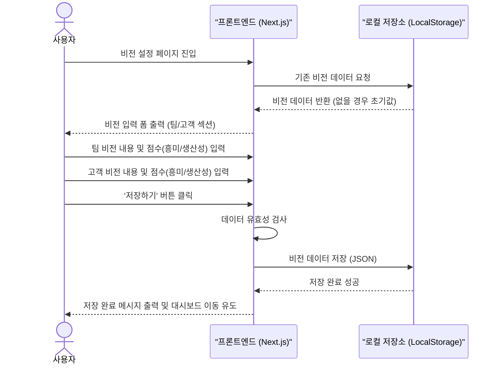
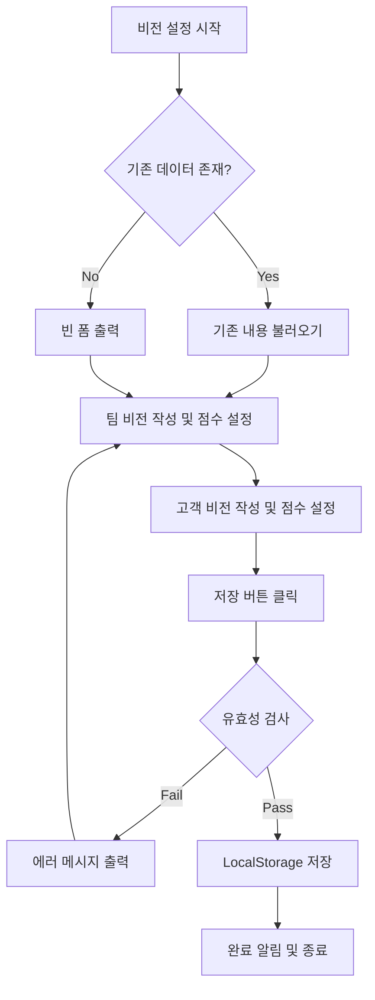

# 비전 관리 유저플로우 (Vision Management Flow)

이 문서는 사용자가 팀 비전과 고객 비전을 수립하고 각각의 기대 만족도 및 생산성을 점수화하는 흐름을 정의합니다.

## 1. 개요
사용자는 자신의 서비스(예: 산책)에 대한 이상적인 상태(팀 비전)와 고객으로서 바라는 상태(고객 비전)를 정의하고, 이를 시각화하기 위한 기초 데이터를 입력합니다.

## 2. 시퀀스 다이어그램 (Sequence Diagram)

## 3. 플로우차트 (Flowchart)

