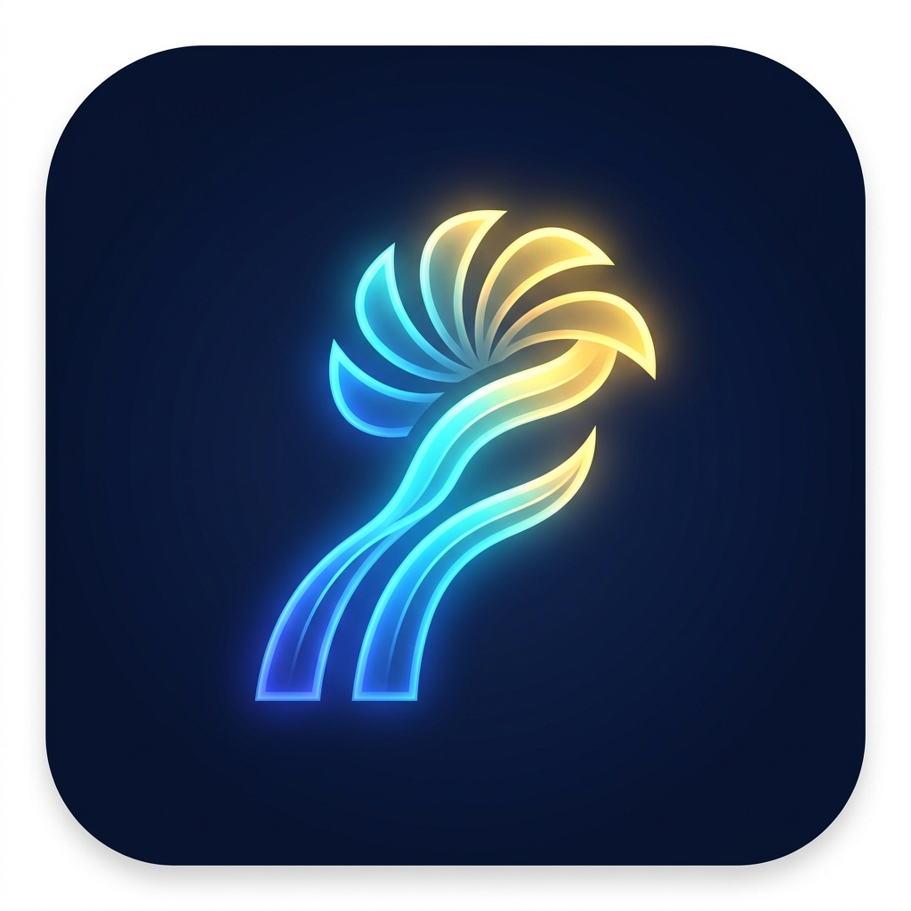

# [최종 보고서] T006 #6: PWA 전환 및 모바일 최적화 완료 보고

- 작성일: 2026-05-06
- 담당: Antigravity (Gemini 3 Flash)
- 상태: 완료 (검토 대기)

## 1. 개요
사용자가 아이폰 홈 화면에 앱을 설치하고, 향후 능동적인 푸쉬 알림을 받을 수 있는 기반을 마련하기 위해 Next.js 프로젝트를 PWA(Progressive Web App)로 전환하였습니다.

## 2. 구현 결과

### 2.1 PWA 인프라 구축
- **기술 스택**: `next-pwa` (Service Worker 자동 생성 및 관리)
- **설정**: `next.config.js`를 수정하여 Webpack 기반 PWA 빌드 파이프라인을 구축하였습니다. (Turbopack과의 호환성 문제 해결을 위해 `--webpack` 플래그 적용)
- **산출물**: 
    - `public/sw.js`: 서비스 워커 스크립트
    - `public/manifest.json`: 웹 앱 매니페스트

### 2.2 모바일 설치 최적화
- **아이콘**: AI로 생성한 프리미엄 아이콘 2종(192x192, 512x512) 및 `apple-touch-icon.png` 배치.
- **메타데이터**: `layout.tsx`에 iOS 전용 설정(`appleWebApp`) 및 Next.js 16 표준 `viewport` 설정 적용.

## 3. 검증 내용
1. **빌드 테스트**: `npm run build` 수행 시 서비스 워커 파일이 정상적으로 생성됨을 확인.
2. **매니페스트 검증**: 앱 이름, 아이콘 경로, `standalone` 모드 작동 여부 확인.
3. **아이폰 호환성**: `apple-touch-icon` 및 웹 앱 기능 활성화 확인.

## 4. 증거 자료 (산출물)

### 앱 아이콘 디자인


### manifest.json 설정값
```json
{
  "name": "Raving Fans: Vision Alignment",
  "short_name": "RavingFans",
  "display": "standalone",
  "background_color": "#f8fafc",
  "theme_color": "#0f172a",
  ...
}
```

## 5. 승인 요청
- [x] 최종 결과 승인 (작업지시자)

---

*본 문서는 [rhwp](https://github.com/edwardkim/rhwp) 프로젝트의 실전 개발 경험 및 방법론을 바탕으로 제작된 템플릿입니다. (원본 문서를 복제 및 수정함)*
